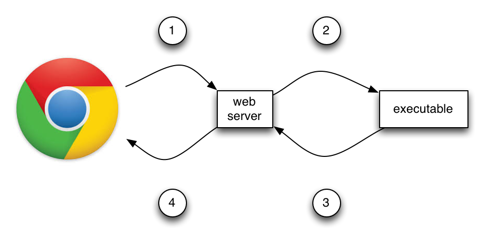
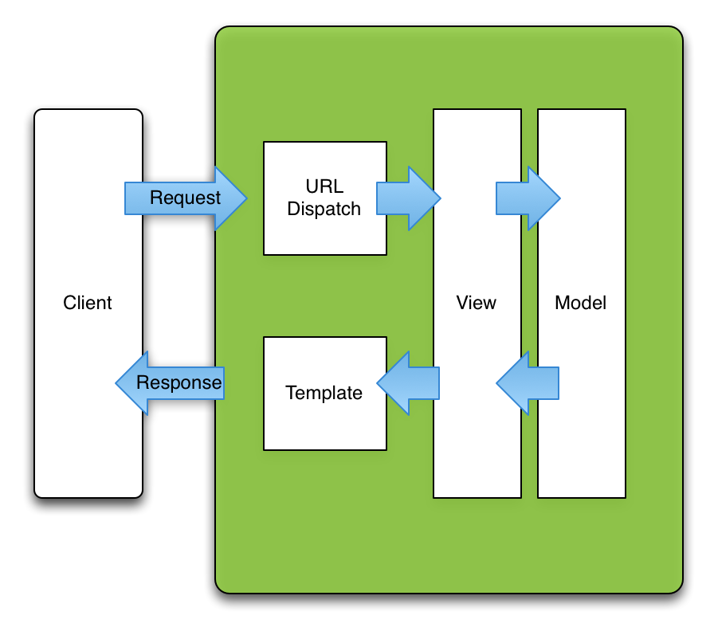

===================
Django Book Intro !
===================

Logo
====

.. image:: http://media.djangopony.com/img/magic-pony-django-wallpaper.png
   :width: 100%
   :align: center
   :scale: 60%

CGI
---

The CGI in python
-----------------------

.. code-block:: bash

    mkdir cgi-bin
    edit cgi-bin/test.py

.. code-block:: python

   	#!/usr/bin/env python
	# -*- coding: utf-8 -*-
	print "Content-Type: text/html"
	print 
	print "<button>hello</button>"

Make it executable
------------------

.. code-block:: bash

	chmod +x  # In UNIX only
	python -m CGIHTTPServer
	open http://localhost:8000/cgi-bin/test.py

Seperate 
-----------

MVC
----

At Least Four FIles

- models.py
- views.py
- urls.py
- template as html

models.py (the database tables)
-------------------------------

.. code-block:: python  

	from django.db import models

	class Book(models.Model):
	    name = models.CharField(max_length=50)
	    pub_date = models.DateField()

views.py (business logic)
-------------------------

.. code-block:: python

	from django.shortcuts import render_to_response
	from models import Book
	def latest_books(request):
	    book_list = Book.objects.order_by('-pub_date')[:10]
	    return render_to_response('latest_books.html', {'book_list': book_list})

urls.py (the URL configuration)
-------------------------------

.. code-block:: python

	from django.conf.urls.defaults import *
	import views

	urlpatterns = patterns('',
	    (r'^latest/$', views.latest_books),
	)

template
--------

.. code-block:: html

	<html><head><title>Books</title></head>
	<body>
	<h1>Books</h1>
	<ul>
	
	<li>{{ book.name }}</li>
	
	</ul>
	</body></html>

Who Makes It?
--------------

- Lawrence Journal-World
- Founded 1858
- web development team start at 2003
- released at  2005 July

Named After Django
------------------

.. image:: https://upload.wikimedia.org/wikipedia/commons/thumb/f/f5/Django_Reinhardt_%28Gottlieb_07301%29.jpg/574px-Django_Reinhardt_%28Gottlieb_07301%29.jpg

Pros!
-----

- Real world framwork from a news company!

Required Skill?
----------------

- Web knowledge 
- Django is a collection of python library

